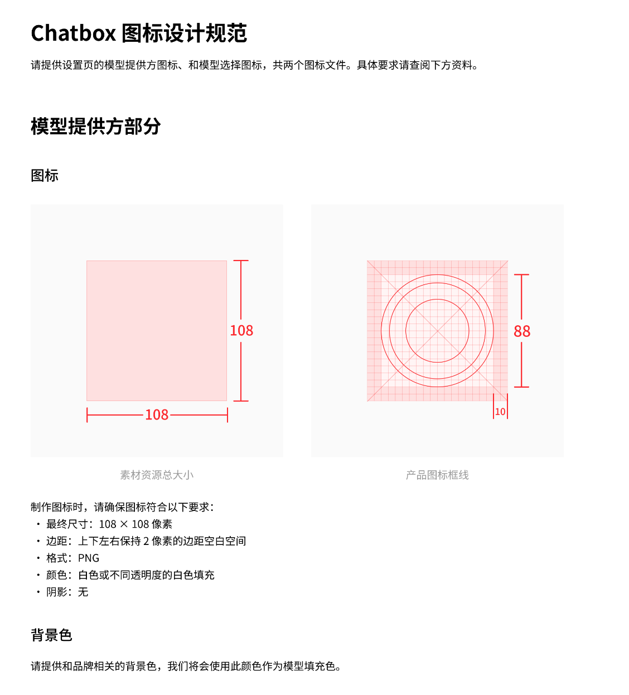

````markdown
# Import Third-Party Provider Configuration

Starting from version **1.15.1**, Chatbox supports importing model provider configurations in JSON format. Some providers offer configurations on their official websites that can be manually copied and imported with one click in the Chatbox software, or imported to the client via deep link.

Supported providers for reference:

* [302.AI](https://help.302.ai/docs/jie-ru-dao-ChatBox)
* [AiHubMix](https://docs.aihubmix.com/cn/clients/ChatBox)
* [ChatAnywhere](https://chatanywhere.apifox.cn/#chatbox-%E9%85%8D%E7%BD%AE%E7%AE%80%E5%8D%95)
* [O3](https://vip1.o3.fan/info/chatbox/) (One-click configuration)
* [BurnCloud](https://www.burncloud.com/zh-cn/posts/chatbox-burncloud-api.html)

#### Configuration Format

```typescript
type ProviderConfig = {
  id: string // Provider ID, must be unique in Chatbox, domain name recommended
  name: string // Provider display name in Chatbox
  type: 'openai' // Currently only supports OpenAI-standard API, more API types will be supported in the future
  iconUrl: string // Icon spec requirements see Icon Specification below
  urls: {
      website: string // Provider website link, e.g., https://chatboxai.app
      getApiKey?: string // Optional: URL to get API key from provider
      docs?: string // Optional: Provider documentation URL
      models?: string // Optional: URL to view provider's model list page
  }
  settings: {
    apiHost: string // Provider's API host, e.g., https://api.openai.com
    apiPath?: string // Provider's API Path, defaults to /v1/chat/completions
    apiKey?: string // User's API key, can also be filled in by user in UI after import
    models: ModelInfo[] // Default model list to display after import, recommend putting the most commonly used ones
  }
}

type ModelInfo = {
  modelId: string // Model ID, e.g., gpt-4o
  nickname?: string // Model display name, defaults to model ID
  type?: 'chat' | 'embedding' | 'rerank' // Model type, defaults to chat
  capabilities?: ('vision' | 'reasoning' | 'tool_use')[] // Model capabilities, determines how Chatbox calls these models
  contextWindow?: number // Model's max context limit, Chatbox uses this to calculate user input limits
  maxOutput?: number // Model's max output limit, Chatbox limits request parameters to not exceed this value, leave empty for no limit
}

```

#### Example Configuration

```json
{
  "id": "openai",
  "name": "OpenAI",
  "type": "openai",
  "iconUrl": "https://openai.com/favicon.ico",
  "urls": { "website": "https://openai.com" },
  "settings": {
    "apiHost": "https://api.openai.com/",
    "models": [
      {
        "modelId": "gpt-4o",
        "nickname": "GPT 4o",
        "type": "chat",
        "capabilities": ["vision", "tool_use"],
        "contextWindow": 128000,
        "maxOutput": 16384
      },
      {
        "modelId": "text-embedding-3-small",
        "type": "embedding"
      }
    ]
  }
}

```

#### Deep Link Format

```
chatbox://provider/import?config=$BASE64_ENCODED_CONFIG
```

Where `BASE64_ENCODED_CONFIG` is the base64-encoded string of the JSON configuration above

#### Provider Icon Specification

<figure><figcaption></figcaption></figure>
````
